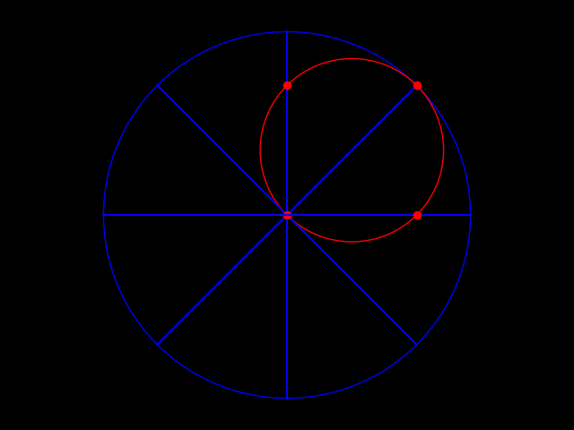

<b><i> Rolling Around </b></i>
==
<i> Problem Description : </i>
--
~~~
Consider a circle (radius R) rolling without slipping on the inner surface of a larger circle (radius 2R). Each point on the smaller circle slides on a straight line through the center of the larger circle during the rolling motion.
~~~
<i> Visualization : </i>
--

<i> Solution : </i>
--
~~~
* The locus of a general point $P$ on the smaller circle is considered in the cylindrical coordinates
* It is shown that angle $\theta_{PO}$ it makes at the center $O$ of the larger circle remains constant due to the no-slip condition
* The variation of the radial distance $r_{PO}$ is also derived
* This solution is coded in a python script to achieve the above animation
~~~
<i> Source : </i>
--
WhatsApp status video of a similar animation from Raj
